# Unified Commerce Lakehouse

> A production-grade Medallion Lakehouse (Bronze → Silver → Gold) that unifies order, marketplace, and inventory data from 3 retail channels into a single trustworthy source of truth - solving the "every team reports a different revenue number" problem.

**Segment:** Data Platform & Pipeline Engineering | **Problem:** B1 | **Author:** Adwaid Krishna K | **Target roles:** Data Engineer, Analytics Engineer, Big Data Engineer

---

## Demo

**[Watch the Loom demo](https://www.loom.com/share/eab7b362b5b14c0aa1417ef8455f9f43)**

**Deployment:** `terraform apply` from `/infrastructure/` boots the entire platform locally - see [Quickstart](#quickstart) below.

---

## Problem Statement

CartCo, a multi-channel retailer, sells through its own storefront (Shopify), a third-party marketplace (Amazon), and manages warehouse inventory via daily file drops. Each system reports independently - there is no single trusted number for revenue, inventory position, or customer activity. Teams reconcile numbers manually, traceability is poor, and there is no centralized analytics layer. This project builds the data platform that solves that: a layered lakehouse that ingests all three sources, progressively cleans and conforms them, and produces analytics-ready business marts with full lineage tracking and automated data quality checks.

---

## Architecture

### Container Diagram (C4 Level 2)



### Component Diagram (C4 Level 3 - pipeline internals)



**Full architecture narrative:** [docs/architecture.md](docs/architecture.md)

The platform runs as 10 Docker containers on a shared network, all provisioned by a single `terraform apply`:

| Container | Purpose |
|---|---|
| MinIO | S3-compatible object storage for all Delta Lake tables |
| Airflow (webserver + scheduler) | Pipeline orchestration - 4 DAGs |
| Hive Metastore | Metadata catalog for all Bronze/Silver/Gold tables |
| Marquez | Data lineage visualization (OpenLineage backend) |
| Grafana | Pipeline health monitoring |
| Postgres × 3 | Separate metadata backends for Airflow, Hive, and Marquez |

---

## Tech Stack

| Component | Choice | Why |
|---|---|---|
| Processing engine | PySpark 3.5 | Distributed compute, native Delta integration |
| Table format | Delta Lake | ACID transactions, schema evolution, time travel |
| Object storage | MinIO | S3-compatible, free, zero account risk - spec-accepted S3 equivalent |
| Orchestration | Apache Airflow | Industry-standard for Data Engineer roles; DAG model fits Bronze→Silver→Gold |
| Data quality | Great Expectations | Automated validation at Bronze + Silver boundaries |
| Lineage | OpenLineage + Marquez | Column-level lineage, visualized in Marquez UI |
| Catalog | Hive Metastore | Native Spark/Delta integration |
| Monitoring | Grafana | Pipeline health dashboard |
| IaC | Terraform (`docker` + `minio` providers) | Provisions the entire local platform |
| Language | Python 3.11 | Industry standard for data engineering |
| Testing | Pytest | 16 unit tests, green CI |
| CI | GitHub Actions | Runs tests on every push and PR |

---

## Quickstart

### Prerequisites

- Docker Desktop (running)
- Terraform >= 1.0 (`terraform -version`)
- Python 3.11+ with venv
- Java 11+ (`java -version`)

### Install

```bash
git clone https://github.com/AKrishnaK05/unified-commerce-lakehouse.git
cd unified-commerce-lakehouse

python -m venv venv
# Windows:
.\venv\Scripts\Activate.ps1
# Mac/Linux:
source venv/bin/activate

pip install -r requirements.txt
```

### Run - Boot the platform

```bash
cd infrastructure
cp terraform.tfvars.example terraform.tfvars
# Edit terraform.tfvars with your own local passwords/keys

terraform init
terraform apply   # type 'yes' when prompted
cd ..
```

Platform URLs once running:

| Service | URL | Credentials |
|---|---|---|
| MinIO Console | http://localhost:9001 | See terraform.tfvars |
| Airflow UI | http://localhost:8080 | admin / see terraform.tfvars |
| Marquez Lineage | http://localhost:3000 | No login required |
| Grafana | http://localhost:3001 | admin / see terraform.tfvars |

### Run - Execute the pipeline

```bash
python scripts/generate_synthetic_data.py
python ingestion/bronze_ingestion.py
python transformations/silver_transformations.py
python transformations/gold_transformations.py
python quality/catalog_registration.py
python quality/lineage_emitter.py
```

Or trigger via Airflow by enabling the `bronze_ingestion` DAG at http://localhost:8080.

### Test

```bash
pytest tests/ -v
```

Expected: **16 passed** in ~15 seconds.

CI status: 

### Tear down

```bash
cd infrastructure && terraform destroy
```

---

## Data

All data is synthetic - generated locally by `scripts/generate_synthetic_data.py`. No real API keys or external services required.

| Source | Records | Messiness injected |
|---|---|---|
| Shopify Orders (mock) | ~510 rows | Nulls, duplicates, late arrivals, schema drift |
| Amazon Marketplace (mock) | ~306 rows | Nulls, duplicates, late arrivals |
| SFTP Inventory Feed (mock) | ~50 rows | Nulls |

- Schema documentation: [docs/sources/sources.md](docs/sources/sources.md)
- Data catalog (all 11 tables): [docs/data-catalog.md](docs/data-catalog.md)
- Data generation docs: [docs/data_generation.md](docs/data_generation.md)
- Data sources: [docs/data.md](docs/data.md)

---

## Architecture Decision Records

| ADR | Decision | Status |
|---|---|---|
| [ADR-001](docs/adr/ADR-001-storage-format.md) | Storage format - Delta Lake | Accepted |
| [ADR-002](docs/adr/ADR-002-orchestrator-choice.md) | Orchestrator - Airflow | Accepted |
| [ADR-003](docs/adr/ADR-003-partition-strategy.md) | Partition strategy per layer | Accepted |
| [ADR-004](docs/adr/ADR-004-ingestion-tool.md) | Ingestion tool - custom Python | Accepted |
| [ADR-005](docs/adr/ADR-005-schema-evolution-policy.md) | Schema evolution policy | Accepted |

---

## Known Limitations

- **Airflow DAGs run pipeline stages via local Python** - a production setup would need a custom Airflow Docker image with PySpark pre-installed
- **Data is synthetic** - real Shopify/Amazon API access requires business verification not obtainable in a 5-week window
- **No HTTPS on MinIO** - appropriate for local dev only; production requires TLS
- **Hive Metastore startup race condition** - may crash-restart once on first `terraform apply`; recovers automatically within ~10 seconds
- **Single-node Spark** - runs in local mode; production would use a real cluster

---

## Roadmap

With 2 more weeks:

1. Custom Airflow Docker image with PySpark pre-installed
2. Kafka streaming source (4th Bronze source, real-time inventory events)
3. Grafana dashboards wired to Airflow's Postgres for live DAG metrics
4. Delta OPTIMIZE + ZORDER compaction jobs
5. Feast feature store from the Gold Customer 360 mart

---

## License

MIT License - see [LICENSE](LICENSE)

## Acknowledgements

Built with: Apache Airflow · Delta Lake · MinIO · Great Expectations · OpenLineage · Marquez · Hive Metastore · Grafana · Terraform · PySpark · Faker