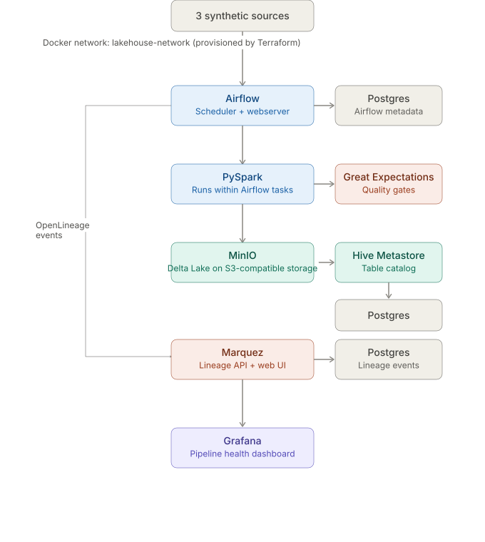
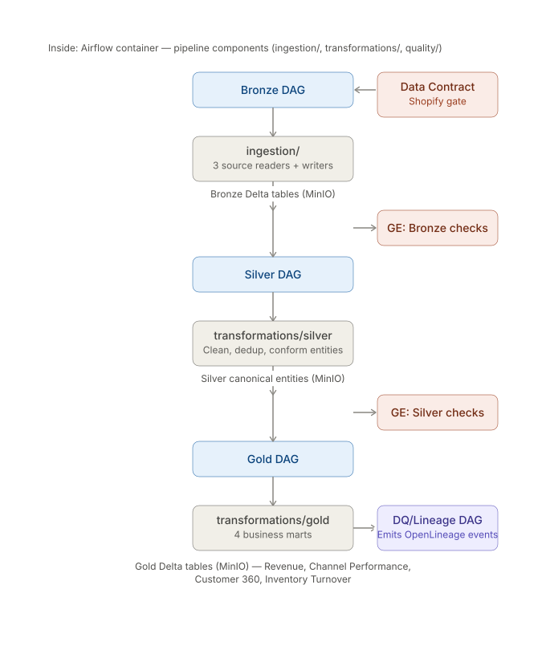

# Unified Commerce Lakehouse

> A production-grade Medallion Lakehouse (Bronze → Silver → Gold) that unifies order, marketplace, and inventory data from 3 retail channels into a single trustworthy source of truth — solving the "every team reports a different revenue number" problem.

**Segment:** Data Platform & Pipeline Engineering | **Problem:** B1 | **Author:** Adwaid Krishna K | **Target roles:** Data Engineer, Analytics Engineer, Big Data Engineer

---

## 🌐 Live Demo

**[unified-commerce-lakehouse.vercel.app](https://unified-commerce-lakehouse.vercel.app/)**

A public analytics and observability dashboard showing:
- **Business Overview** — Revenue, orders, channel split, product performance
- **Data Engineering** — Pipeline run timeline, records by layer, DQ metrics
- **Lineage** — Interactive graph — click any table to trace upstream sources and downstream consumers

🎬 **[Watch the 5-min Loom demo](#)**

---

## Problem Statement

CartCo, a multi-channel retailer, sells through its own storefront (Shopify), a third-party marketplace (Amazon), and manages warehouse inventory via daily file drops. Each system reports independently — there is no single trusted number for revenue, inventory position, or customer activity. Teams reconcile numbers manually, traceability is poor, and there is no centralized analytics layer. This project builds the data platform that solves that: a layered lakehouse that ingests all three sources, progressively cleans and conforms them, and produces analytics-ready business marts with full lineage tracking and automated data quality checks.

---

## Architecture

### Container Diagram (C4 Level 2)


### Component Diagram (C4 Level 3 — pipeline internals)


**Full architecture narrative:** [docs/architecture.md](docs/architecture.md)

The platform runs as 10 Docker containers on a shared network, all provisioned by a single `terraform apply`:

| Container | Purpose |
|---|---|
| MinIO | S3-compatible object storage for all Delta Lake tables |
| Airflow (webserver + scheduler) | Pipeline orchestration — 4 DAGs, custom image with PySpark |
| Hive Metastore | Metadata catalog for all Bronze/Silver/Gold tables |
| Marquez | Data lineage visualization (OpenLineage backend) |
| Grafana | Pipeline health monitoring dashboard |
| Postgres × 3 | Separate metadata backends for Airflow, Hive, and Marquez |

---

## Tech Stack

| Component | Choice | Why |
|---|---|---|
| Processing engine | PySpark 3.5 | Distributed compute, native Delta integration |
| Table format | Delta Lake | ACID transactions, schema evolution, time travel |
| Object storage | MinIO | S3-compatible, free, zero account risk — spec-accepted S3 equivalent |
| Orchestration | Apache Airflow | Industry-standard for Data Engineer roles; custom Docker image with PySpark |
| Data quality | Great Expectations | Automated validation at Bronze + Silver boundaries |
| Lineage | OpenLineage + Marquez | Column-level lineage, visualized in Marquez UI |
| Catalog | Hive Metastore | Native Spark/Delta integration |
| Monitoring | Grafana | Pipeline health dashboard |
| IaC | Terraform (`docker` + `minio` providers) | Provisions the entire local platform |
| Public dashboard | React + Vercel | Public analytics/observability layer |
| Language | Python 3.11 | Industry standard for data engineering |
| Testing | Pytest | 16 unit + integration tests, green CI |
| CI | GitHub Actions | Runs tests on every push and PR |

---

## Quickstart

### Prerequisites
- Docker Desktop (running)
- Terraform >= 1.0 (`terraform -version`)
- Python 3.11+ with venv
- Java 11+ (`java -version`)

### Install

```bash
git clone https://github.com/AKrishnaK05/unified-commerce-lakehouse.git
cd unified-commerce-lakehouse

python -m venv venv
.\venv\Scripts\Activate.ps1   # Windows
source venv/bin/activate       # Mac/Linux

pip install -r requirements.txt
```

### Boot the platform

```bash
cd infrastructure
cp terraform.tfvars.example terraform.tfvars
# Edit terraform.tfvars with your own passwords/keys

terraform init
terraform apply   # type 'yes' — builds custom Airflow image, boots all 10 containers
cd ..
```

Platform URLs once running:

| Service | URL | Purpose |
|---|---|---|
| Airflow UI | http://localhost:8080 | Trigger and monitor DAGs |
| MinIO Console | http://localhost:9001 | Browse Delta Lake tables |
| Marquez Lineage | http://localhost:3000 | Visualize column-level lineage |
| Grafana | http://localhost:3001 | Pipeline health dashboard |
| **Public Dashboard** | **https://unified-commerce-lakehouse.vercel.app/** | **No login needed** |

### Run the pipeline

```bash
# Generate synthetic data for all 3 sources
python scripts/generate_synthetic_data.py

# Option A — trigger via Airflow (recommended, shows full orchestration)
# Open localhost:8080 → enable bronze_ingestion DAG → trigger
# Pipeline chain fires automatically: Bronze → Silver → Gold → DQ/Lineage

# Option B — run manually step by step
python ingestion/bronze_ingestion.py
python transformations/silver_transformations.py
python transformations/gold_transformations.py
python quality/catalog_registration.py
python quality/lineage_emitter.py
```

### Test

```bash
pytest tests/ -v
```

Expected: **16 passed** in ~15 seconds.

CI: 

### Tear down

```bash
cd infrastructure && terraform destroy
```

---

## Data

All data is synthetic — generated by `scripts/generate_synthetic_data.py`. No real API keys or accounts required.

| Source | Records | Messiness injected |
|---|---|---|
| Shopify Orders (mock) | ~510 rows | Nulls, duplicates, late arrivals, schema drift |
| Amazon Marketplace (mock) | ~306 rows | Nulls, duplicates, late arrivals |
| SFTP Inventory Feed (mock) | ~50 rows | Nulls |

- Schema documentation: [docs/sources/sources.md](docs/sources/sources.md)
- Data catalog (all 11 tables): [docs/catalog.md](docs/catalog.md)
- Data generation docs: [docs/data_generation.md](docs/data_generation.md)
- Data sources: [docs/data.md](docs/data.md)

---

## Architecture Decision Records

| ADR | Decision | Status |
|---|---|---|
| [ADR-001](docs/adr/ADR-001-storage-format.md) | Storage format — Delta Lake over Iceberg/Postgres | Accepted |
| [ADR-002](docs/adr/ADR-002-orchestrator-choice.md) | Orchestrator — Airflow over Dagster/Prefect | Accepted |
| [ADR-003](docs/adr/ADR-003-partition-strategy.md) | Partition strategy per layer | Accepted |
| [ADR-004](docs/adr/ADR-004-ingestion-tool.md) | Ingestion tool — custom Python over Airbyte | Accepted |
| [ADR-005](docs/adr/ADR-005-schema-evolution-policy.md) | Schema evolution — Accept/Controlled/Strict per layer | Accepted |

---

## Known Limitations

- **Airflow tasks use custom Docker image** — PySpark runs inside the Airflow container via a custom image (Dockerfile in repo root). A fresh `terraform apply` builds this image; first build takes ~5-10 minutes.
- **Data is synthetic** — real API access requires business verification not obtainable in a 5-week window
- **No HTTPS on MinIO** — local dev only; production requires TLS
- **Hive Metastore startup race condition** — may crash-restart once on first `terraform apply`; recovers automatically within ~10 seconds. Fix: healthcheck-based `depends_on` (documented in [postmortem](docs/postmortem.md))
- **Single-node Spark** — runs in local mode; production would use a real cluster

---

## Roadmap

1. Grafana dashboards with task-level metrics and GE pass rates
2. Kafka streaming source (4th Bronze source, real-time inventory events)
3. Healthcheck-based `depends_on` in Terraform for Hive Metastore
4. Live data refresh on the public dashboard (GitHub Actions cron → push updated JSON)

---

## Documentation

| Doc | Purpose |
|---|---|
| [docs/architecture.md](docs/architecture.md) | Full C4 architecture narrative |
| [docs/catalog.md](docs/catalog.md) | All 11 tables with column-level types and ownership |
| [docs/data.md](docs/data.md) | Data sources, volumes, messiness injected |
| [docs/test_report.md](docs/test_report.md) | 16 tests — what's covered and what's not |
| [docs/adr/](docs/adr/) | 5 Architecture Decision Records |
| [docs/thinking_artifact.md](docs/thinking_artifact.md) | "How I built this" — 5 non-obvious decisions |
| [docs/postmortem.md](docs/postmortem.md) | 2 real incidents, root causes, fixes, lessons |
| [docs/mock_interview.md](docs/mock_interview.md) | 10 interview Q&A |

---

## License

MIT License — see [LICENSE](LICENSE)

## Acknowledgements

Built with: Apache Airflow · Delta Lake · MinIO · Great Expectations · OpenLineage · Marquez · Hive Metastore · Grafana · Terraform · PySpark · Faker · React · Vercel