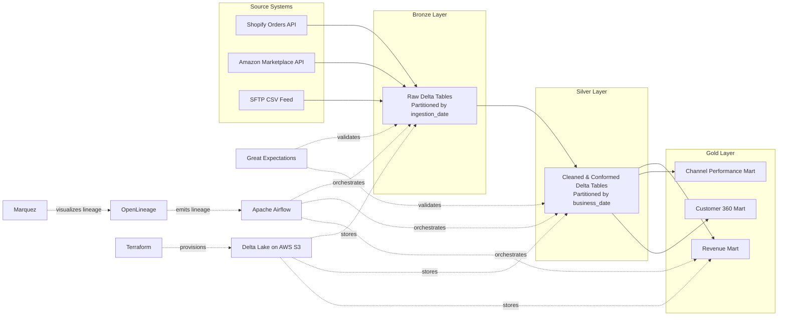

# Initial Design Document – Unified Commerce Lakehouse

A production-grade Medallion Lakehouse (Bronze → Silver → Gold) that unifies data from three representative retail source systems into a single trustworthy source of truth. The project focuses on demonstrating modern Data Engineering practices including Delta Lake, Spark, Airflow, Data Quality, Lineage, Infrastructure as Code, and Lakehouse architecture patterns.

---

# 1. Problem Statement

A multi-channel retailer ("CartCo") sells through its own storefront, a third-party marketplace, and maintains separate operational systems. Each system reports independently, creating inconsistent revenue reporting, fragmented analytics, poor traceability, and limited trust in business metrics.

The objective of this project is to build a Unified Commerce Lakehouse that ingests data from representative retail systems, progressively cleans and standardizes it, and produces trusted analytics-ready business marts.

---

# 2. Scope Boundaries (Locked Decisions)

| Decision                    | Choice                                                     | Why                                                                                                                                                                                                                                                                       |
| --------------------------- | ---------------------------------------------------------- | ------------------------------------------------------------------------------------------------------------------------------------------------------------------------------------------------------------------------------------------------------------------------- |
| Data Source Strategy        | Synthetic / Mocked Data                                    | Real Shopify and Amazon integrations require authentication and business verification beyond the internship scope. The focus is Data Engineering, not API onboarding.                                                                                                     |
| Number of Sources           | 3 Representative Sources                                   | Project guidelines permit implementing 2–3 sources. The selected sources demonstrate multiple ingestion patterns while keeping scope realistic.                                                                                                                           |
| Streaming                   | Deferred                                                   | Kafka is part of CartCo's production landscape. For this internship implementation, the focus is on building a robust batch-oriented lakehouse using API and file-based ingestion patterns. Streaming architecture considerations will be documented but not implemented. |
| Container Orchestration     | Docker Compose                                             | Single-developer project. Kubernetes would add complexity without meaningful learning value for this timeline.                                                                                                                                                            |
| Object Storage              | AWS S3                                                     | Industry-standard storage layer used by modern lakehouse architectures.                                                                                                                                                                                                   |
| Infrastructure Provisioning | Terraform                                                  | Satisfies Infrastructure-as-Code requirements while providing reproducible environments.                                                                                                                                                                                  |
| Stretch Goal                | Data Contract                                              | Demonstrates modern data governance without introducing unnecessary platform complexity.                                                                                                                                                                                  |
| Partitioning Strategy       | Bronze: ingestion date, Silver: business date, Gold: month | Aligns storage design with both traceability and analytics requirements.                                                                                                                                                                                                  |

---

# 3. Source Systems

The project intentionally implements three representative source systems.

## Source 1 – Shopify Orders API (Mock)

Purpose:

Capture e-commerce order transactions.

Example Fields:

* order_id
* customer_id
* product_id
* order_date
* quantity
* revenue
* order_status

Ingestion Pattern:

API-based Batch Ingestion

Refresh Frequency:

Daily

---

## Source 2 – Amazon Marketplace API (Mock)

Purpose:

Capture marketplace sales transactions.

Example Fields:

* marketplace_order_id
* customer_id
* sku
* quantity
* revenue
* order_timestamp

Ingestion Pattern:

API-based Batch Ingestion

Refresh Frequency:

Daily

---

## Source 3 – SFTP CSV Drop

Purpose:

Simulate operational data feeds delivered through batch files.

Example Fields:

* inventory_id
* product_id
* warehouse_id
* quantity_available
* quantity_reserved
* last_updated

Ingestion Pattern:

File-based Batch Ingestion

Refresh Frequency:

Daily

---

# 4. Technology Stack

| Component              | Choice                    | Why                                                                     |
| ---------------------- | ------------------------- | ----------------------------------------------------------------------- |
| Programming Language   | Python                    | Industry-standard language for Data Engineering                         |
| Processing Engine      | PySpark                   | Distributed data processing engine widely used in modern data platforms |
| Table Format           | Delta Lake                | ACID transactions, schema evolution, time travel                        |
| Object Storage         | AWS S3                    | Industry-standard lakehouse storage                                     |
| Orchestration          | Apache Airflow            | Workflow orchestration, retries, scheduling, monitoring                 |
| Data Quality           | Great Expectations        | Automated data validation and quality checks                            |
| Lineage                | OpenLineage + Marquez     | End-to-end lineage tracking and observability                           |
| Metadata Catalog       | AWS Glue Data Catalog     | Centralized metadata management and dataset discovery                   |
| Infrastructure as Code | Terraform                 | Reproducible infrastructure provisioning                                |
| Containerization       | Docker Compose            | Local development environment                                           |
| Testing                | Pytest                    | Unit and integration testing                                            |
| Monitoring             | Grafana                   | Pipeline health monitoring                                              |
| Documentation          | Markdown + ADRs + Mermaid | Version-controlled engineering documentation                            |

---

# 5. Architecture Overview

---

# 6. Technical Direction Coverage

## Open Table Format – Delta Lake

The project will demonstrate:

* ACID Transactions
* Schema Evolution
* Time Travel

Example demonstrations:

* Query historical table versions
* Handle schema changes safely
* Recover previous versions when required

---

## Medallion Architecture

The platform follows a strict Bronze → Silver → Gold architecture.

### Bronze

Responsibilities:

* Raw source preservation
* Ingestion metadata
* Auditability

### Silver

Responsibilities:

* Cleaning
* Standardization
* Deduplication
* Validation

### Gold

Responsibilities:

* Business-ready datasets
* Aggregations
* KPI generation

Layer boundaries are enforced through separate storage locations and transformation pipelines.

---

## Distributed Compute

PySpark will be used for all major transformations.

Concepts demonstrated:

* Partitioning
* Join strategies
* Broadcast joins
* Shuffle-aware transformations

---

## Orchestration

Airflow DAGs will implement:

* Task dependencies
* Retry policies
* Idempotent execution
* File sensors
* SLA monitoring

---

## Data Quality

Great Expectations will validate:

* Schema compliance
* Null constraints
* Uniqueness constraints
* Business rules

Failures will be categorized as:

* Critical (fail pipeline)
* Warning (log and continue)

---

## Data Lineage

OpenLineage and Marquez will be used to track lineage.

Benefits:

* Faster debugging
* Impact analysis
* Increased trust in analytics

---

## Cost & Performance

The project will demonstrate:

* Partitioning strategies
* Query pruning
* File organization best practices
* Delta optimization concepts

---

# 7. Metadata Catalog

AWS Glue Data Catalog will be used to maintain metadata for Bronze, Silver, and Gold datasets.

The catalog will contain:

* Table descriptions
* Column data types
* Dataset ownership information
* Business definitions

This improves discoverability, governance, and documentation.

---

# 8. Infrastructure as Code

Terraform will provision:

* Bronze S3 Bucket
* Silver S3 Bucket
* Gold S3 Bucket
* IAM Policies
* Core platform infrastructure configuration

Terraform will be the primary Infrastructure-as-Code tool used to manage cloud resources and platform configuration.

Docker Compose will be used for local execution and development workflows.

---

# 9. Stretch Goal – Data Contract

A schema-as-code data contract will be implemented for the Shopify Orders source.

The contract will define:

* Source owner
* Schema version
* Required fields
* Data types
* Validation rules

Incoming data will be validated against the contract before ingestion into the Bronze layer.

---

# 10. Key Risks

## Learning Curve

New technologies include:

* Airflow
* Great Expectations
* Terraform
* OpenLineage

Mitigation:

Incremental implementation and dedicated learning time.

---

## Infrastructure Complexity

Several platform components must integrate correctly.

Mitigation:

Build and validate each component independently before integration.

---

## Time Constraints

Five-week delivery window.

Mitigation:

Prioritize core platform requirements before optional enhancements.

---

# 11. Success Criteria

* 3 representative source connectors implemented
* Bronze layer completed
* Silver layer completed
* Gold layer completed
* Delta Lake implemented
* Airflow orchestration working
* Great Expectations validations working
* OpenLineage integration working
* Marquez lineage visualization working
* AWS Glue Data Catalog configured
* Table ownership and descriptions documented
* Terraform provisioning completed
* AWS S3 storage operational
* Data Contract implemented
* Grafana dashboard operational
* Five ADRs completed
* Documentation complete

---

# 12. Expected Outcomes

By the end of the internship, this project will demonstrate:

* Modern Lakehouse Architecture
* Medallion Data Modeling
* Distributed Data Processing
* Data Quality Engineering
* Workflow Orchestration
* Data Lineage
* Infrastructure as Code
* Metadata Management
* Engineering Documentation
* Production-Oriented Data Engineering Practices

The final repository will serve as a portfolio-ready project aligned with Data Engineering, Analytics Engineering, Data Platform Engineering, and Big Data Engineering roles.