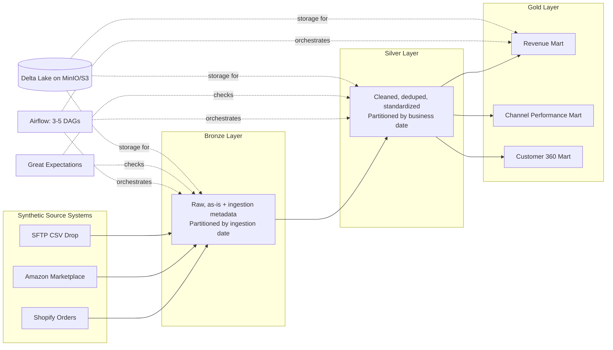

# Initial design document - Unified Commerce Lakehouse
A production-grade medallion lakehouse (Bronze → Silver → Gold) that unifies order, marketplace, inventory, and customer data from 4 simulated retail channels into a single trustworthy source of truth.

---

## Problem Statement
A multi-channel retailer ("CartCo") sells through its own storefront, a third-party marketplace, and maintains separate inventory and customer systems. Each system reports independently, so there is no single trusted number for revenue, inventory position, or customer activity. Teams reconcile numbers manually, traceability is poor, and there is no centralized analytics layer. This project builds the data platform that solves that: a layered lakehouse that ingests all four sources, progressively cleans and conforms them, and produces analytics-ready business marts.

---

## Scope Boundaries (locked decisions)
 
| Decision | Choice | Why |
|---|---|---|
| Data source strategy | **Synthetic/mocked data**, not real APIs | Real Shopify/Amazon Selling Partner API access requires business verification not obtainable in a 5-week window. The Compendium explicitly permits synthetic data. Pipeline engineering quality is what's being evaluated, not data authenticity. |
| Streaming (Kafka) | **Out of core scope** | Listed as a bonus/stretch item only. Adding streaming before batch is solid is a common over-scoping mistake. Revisit only after Milestone 1 ships. |
| Container orchestration | **Docker Compose**, not Kubernetes | Single-developer, local-first, 5-week build. Kubernetes is scope creep belonging to the Cloud-Native segment, not Data Platform. |
| Partitioning | Bronze by ingestion date, Silver by business/order date, Gold by month | Bronze exists for traceability ("what arrived when"); Silver/Gold exist to answer business questions efficiently. |

---

## 4. Tech Stack
 
| Component | Choice | Why |
|---|---|---|
| **Storage location** | MinIO (S3-compatible) | Spec explicitly requires S3/MinIO for storage, not local filesystem. MinIO chosen over real AWS S3 to stay free-tier and fully local/reproducible. |
| **Storage format** | Delta Lake | ACID guarantees, schema evolution, time-travel, tight native PySpark integration. The project's explicit goal is to demonstrate lakehouse/open-table-format skills. |
| **Processing engine** | PySpark | Industry-standard for lakehouse compute; pairs natively with Delta. |
| **Orchestration** | Apache Airflow | Strongest recruiter name-recognition for Data Engineer roles; DAG model maps cleanly onto Bronze→Silver→Gold dependencies. |
| **Data quality** | Great Expectations | Most widely adopted DQ framework for Spark/pandas pipelines; integrates with both schema checks (Bronze) and business-rule checks (Silver). |
| **Pipeline observability** | Grafana (minimal dashboard) | Spec explicitly requires a basic pipeline-health dashboard; scoped to 1-2 panels (DAG success/failure, run duration) rather than a full monitoring stack. |
| **Containerization** | Docker Compose | One-command reproducibility (`docker-compose up`), matching the exact deliverable shape required for Milestone 1 if no live cloud deployment is used. Substitutes for the spec's suggested Terraform — documented as ADR-004. |
| **Documentation** | Markdown (ADRs, catalog, README) | Lightweight, version-controlled, recruiter-readable without extra tooling. |
 
---
 
## 5. Architecture Sketch
 

 
*All tables stored as Delta Lake on MinIO/S3. Orchestrated end-to-end by Airflow DAGs. Quality-checked by Great Expectations at Bronze and Silver gates. Lineage emitted via OpenLineage; a basic Grafana dashboard tracks pipeline health.*
 
---

## 6. Key Risks & Open Items
 
- **Great Expectations has a real learning curve** (Expectation Suites, Checkpoints, Data Contexts) — budgeting genuine ramp-up time in Week 3 rather than treating it as a last-minute add.
- **Lineage and catalog tooling (OpenLineage/Marquez, formal catalog)** are stretch items — if Week 3 gets tight, these will be scoped down to documented intent + minimal stub rather than full implementations, with the trade-off recorded in an ADR.
- **Synthetic data realism** — mitigating the "less real" feel of mock data by deliberately injecting realistic messiness (nulls, duplicates, late-arriving records, schema drift) and documenting generation logic clearly in `/docs/data.md`.
---
 
## 7. Success Criteria (Technical)
 
- [ ] 3 synthetic source connectors (Shopify, Amazon, SFTP CSV)
- [ ] Bronze layer (raw, partitioned by ingestion date)
- [ ] Silver layer (cleaned, deduped, partitioned by business date)
- [ ] Gold layer (Revenue, Channel Performance, Customer 360 marts; partitioned by month)
- [ ] Airflow orchestration (3–5 DAGs)
- [ ] Data quality checks (Great Expectations)
- [ ] Lineage (OpenLineage/Marquez)
- [ ] Basic Grafana dashboard for pipeline health
- [ ] Catalog with table/column-level documentation
- [ ] Dockerized environment (`docker-compose up`)
- [ ] 5 ADRs: table format, orchestrator choice, partition strategy, ingestion tool, schema evolution policy
- [ ] Documentation complete (README, catalog, ADRs)
