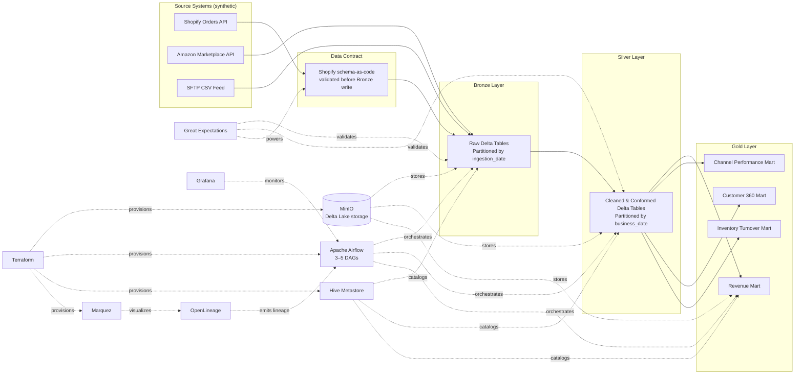

# Initial Design Document — Unified Commerce Lakehouse

**Author:** Adwaid Krishna K\
**Segment:** Data Platform & Pipeline Engineering

A production-grade Medallion Lakehouse (Bronze → Silver → Gold) that unifies data from three representative retail source systems into a single trustworthy source of truth, fully provisioned via Infrastructure as Code and running entirely on free, local infrastructure.

---

## 1. Problem Statement

A multi-channel retailer ("CartCo") sells through its own storefront, a third-party marketplace, and receives daily distributor data via file drops. Each system reports independently, creating inconsistent revenue reporting, fragmented analytics, poor traceability, and limited trust in business metrics. This project builds a Unified Commerce Lakehouse that ingests data from representative retail systems, progressively cleans and standardizes it, and produces trusted, analytics-ready business marts.

---

## 2. Requirement Coverage Map

Every item below is a named requirement from the B1 problem statement and its Scope Boundaries. Nothing here is invented; nothing required is omitted.

| Spec requirement | This project's answer |
|---|---|
| 2–3 source connectors (synthetic OK) | 3: Shopify, Amazon, SFTP CSV |
| Storage: S3 or MinIO | MinIO |
| Open table format: Iceberg or Delta | Delta Lake |
| Compute: Spark (PySpark) | PySpark |
| Bronze / Silver / Gold layers | All 3, as specified |
| Orchestration: Airflow/Dagster/Prefect, 3–5 DAGs | Airflow, 3–5 DAGs |
| Lineage: OpenLineage + Marquez/DataHub | OpenLineage + Marquez |
| Data quality: Great Expectations | Great Expectations |
| Basic Grafana dashboard | Grafana |
| Catalog: Hive Metastore/Glue/Nessie | Hive Metastore |
| IaC: Terraform/Pulumi, provisions the whole stack | Terraform (`docker` + `minio` providers) |
| Stretch — pick at least one | Data Contract (Shopify source) |
| 5 ADRs | Table format, orchestrator, partition strategy, ingestion tool, schema evolution policy |
| Architecture diagram — C4 Container + Component | Both produced |
| Live deployment OR reproducible `docker-compose up` | Reproducible `terraform apply` |

---

## 3. Scope Boundaries (Locked Decisions)

| Decision | Choice | Why |
|---|---|---|
| Data source strategy | Synthetic / mocked data | Real Shopify and Amazon API access requires business verification beyond internship scope. Spec explicitly permits synthetic data; what's evaluated is pipeline engineering, not data authenticity. |
| Number of sources | 3 | Spec's Scope Boundaries caps in-scope connectors at 2–3, not more. |
| Storage | MinIO, not real AWS S3 | Spec explicitly lists MinIO as an accepted equivalent to S3. As of July 2025, new AWS accounts no longer get a permanent free S3 tier — only a one-time, time-limited credit balance — and Glue/EC2-adjacent services bill per use. MinIO is S3-protocol-compatible, free, and removes all billing/IAM risk while staying fully spec-compliant. |
| IaC target | Terraform provisioning **local Docker infrastructure** (via the `docker` and `minio` Terraform providers), not cloud resources | The spec's own example of what Terraform should provision is "MinIO + Airflow + Spark + Marquez" — local infra is the literal spec example, not a workaround. This satisfies the IaC requirement in full while keeping the project free and reproducible by anyone who clones the repo. |
| Catalog | Hive Metastore | Pairs natively with Spark + Delta Lake (already the chosen compute/storage stack); most widely documented option of the three accepted by spec. |
| Streaming (Kafka) | Out of core scope | Listed under spec's Bonus list, not Scope Boundaries' in-scope list. Will only be attempted after all mandatory requirements are complete and verified working. |
| Stretch goal | Data Contract (Shopify source) | Spec requires picking at least one stretch item. Of the three options (streaming, data contract, feature store), this is achievable without new infrastructure — schema-as-code plus a validation gate, reusing the same Great Expectations stack already in scope. |
| Partitioning | Bronze by ingestion date, Silver by business/order date, Gold by month | Bronze exists for traceability ("what arrived when"); Silver/Gold exist to answer business questions efficiently — matches spec's explicit Bronze partitioning instruction. |

---

## 4. Source Systems

### Source 1 — Shopify Orders API (Mock)
**Purpose:** E-commerce order transactions
**Fields:** order_id, customer_id, product_id, order_date, quantity, revenue, order_status
**Ingestion pattern:** API-based batch
**Refresh:** Daily
**Note:** This is also the source used for the Data Contract stretch goal.

### Source 2 — Amazon Marketplace API (Mock)
**Purpose:** Marketplace sales transactions
**Fields:** marketplace_order_id, customer_id, sku, quantity, revenue, order_timestamp
**Ingestion pattern:** API-based batch
**Refresh:** Daily

### Source 3 — SFTP CSV Drop
**Purpose:** Simulated distributor/operational file feed
**Fields:** inventory_id, product_id, warehouse_id, quantity_available, quantity_reserved, last_updated
**Ingestion pattern:** File-based batch
**Refresh:** Daily

---

## 5. Technology Stack

| Component | Choice | Why |
|---|---|---|
| Programming language | Python | Industry-standard for data engineering |
| Processing engine | PySpark | Distributed compute, native Delta integration, explicitly named in spec |
| Table format | Delta Lake | ACID transactions, schema evolution, time travel; spec requires picking one open table format |
| Object storage | MinIO (S3-compatible) | Free, local, zero account/billing risk; spec-accepted equivalent to S3 |
| Orchestration | Apache Airflow | Strongest DE-role recruiter recognition; DAG model fits Bronze→Silver→Gold dependencies |
| Data quality | Great Expectations | Most widely adopted DQ framework for Spark/pandas; also powers the Data Contract validation gate |
| Lineage | OpenLineage + Marquez | Spec-named pairing for end-to-end column-level lineage |
| Metadata catalog | Hive Metastore | Native Spark/Delta integration; spec-accepted catalog option |
| Pipeline monitoring | Grafana | Spec-required basic pipeline-health dashboard |
| Infrastructure as Code | Terraform (`docker` + `minio` providers) | Provisions the entire local stack declaratively — satisfies IaC requirement without cloud cost/risk |
| Testing | Pytest | Unit and integration testing |
| Documentation | Markdown + ADRs + Mermaid | Version-controlled, recruiter-readable |

---

## 6. Architecture Overview

*This is the Container-level view. A separate Component-level diagram (per DAG / per layer internals) will be produced once the pipeline implementation begins — required by spec as a second, more detailed C4 view.*

---

## 7. Technical Direction Coverage

**Open Table Format (Delta Lake):**

The project will demonstrate:

- ACID Transactions
- Schema Evolution
- Time Travel

Example demonstrations:

- Query historical versions of Delta tables.
- Recover previous table versions after accidental updates.
- Handle schema changes safely without rebuilding the table.

Example scenario:

If the Shopify Orders source introduces a new column such as `discount_code`, the pipeline will evolve the Delta table schema while preserving existing historical data.

**Medallion architecture:** Strict Bronze → Silver → Gold boundaries enforced via separate storage locations and transformation pipelines.
- *Bronze:* raw preservation, ingestion metadata, auditability
- *Silver:* cleaning, standardization, deduplication, validation
- *Gold:* business-ready datasets, aggregations, KPIs

**Distributed compute (PySpark):** partitioning, join strategies, broadcast joins, shuffle-aware transformations.

**Orchestration (Airflow):**

Airflow DAGs will implement:

- Task dependencies
- Retry policies
- Idempotent execution
- File sensors
- SLA monitoring

The project will consist of **3–5 DAGs**, covering ingestion, transformation, business marts, and data quality/lineage workflows.

### Idempotency Strategy

Each DAG will detect whether a dataset partition has already been successfully processed before writing outputs.

Pipeline executions must be safely re-runnable without creating duplicate records or corrupting downstream datasets. This ensures recovery from task failures while maintaining data consistency.

**Data quality (Great Expectations):** schema compliance, null constraints, uniqueness constraints, business rules. Failures categorized as Critical (fail pipeline) or Warning (log and continue).

**Data lineage (OpenLineage + Marquez):** column-level lineage for faster debugging, impact analysis, and trust in analytics.

**Cost & Performance**

The project will demonstrate:

- Partitioning strategy
- Query pruning
- File sizing best practices
- Delta Lake compaction concepts
- Delta optimization techniques

Although the project operates on synthetic datasets, the storage layout will follow production-oriented design principles that scale to larger workloads.

---

## 8. Metadata Catalog

Hive Metastore will maintain metadata for all Bronze, Silver, and Gold datasets, including table descriptions, column data types, and dataset ownership — satisfying the spec's catalog requirement in full.

---

## 9. Infrastructure as Code

Terraform will provision, via the `docker` and `minio` providers:
- MinIO container + buckets (bronze, silver, gold) + access policies
- Airflow webserver, scheduler, and metadata Postgres containers
- Hive Metastore container
- Marquez (lineage) container
- Grafana container
- The Docker network connecting all of the above

This makes the entire platform reproducible with `terraform apply` from a clean clone — satisfying the spec's IaC requirement using the spec's own named example stack (MinIO + Airflow + Spark + Marquez), without any cloud account, billing, or IAM risk.

---

## 10. Stretch Goal — Data Contract

A schema-as-code data contract will be implemented for the Shopify Orders source, defining:
- Source owner
- Schema version
- Required fields and data types
- Validation rules

Incoming Shopify data will be validated against this contract (via Great Expectations) before being written to Bronze — satisfying the spec's "pick at least one" stretch requirement with the least additional infrastructure of the three available options.

---

## 11. Key Risks

| Risk | Mitigation |
|---|---|
| Learning curve across Airflow, Great Expectations, Terraform, OpenLineage, Hive Metastore simultaneously | Time is not constrained for this build; ramp-up time is budgeted per tool rather than compressed. Build and validate each component independently before integrating. |
| Infrastructure integration complexity (6+ containers via Terraform) | Validate each Terraform-provisioned service independently (`terraform apply -target=`) before wiring them together. |
| Five mandatory ADRs plus stretch documentation | Draft ADRs incrementally as each decision is made, not retroactively at the end. |

---

## 12. Success Criteria

- 3 synthetic source connectors implemented (Shopify, Amazon, SFTP CSV)
- Data Contract validation gate on Shopify source
- Bronze layer complete (Delta on MinIO, partitioned by ingestion date)
- Silver layer complete (cleaned, deduped, partitioned by business date)
- Gold layer complete (Revenue, Channel Performance, Customer 360, Inventory Turnover marts; partitioned by month)
- Airflow orchestration — 3–5 DAGs working end-to-end
- Great Expectations validations passing at Bronze and Silver gates
- OpenLineage emitting lineage from Airflow
- Marquez visualizing lineage
- Hive Metastore cataloging all Bronze/Silver/Gold tables with descriptions, types, ownership
- Grafana dashboard showing pipeline health
- Terraform provisioning the entire stack from a clean clone
- 5 ADRs complete: table format, orchestrator choice, partition strategy, ingestion tool, schema evolution policy
- C4 Container diagram + C4 Component diagram
- Loom walkthrough recorded
- Resume bullets drafted
- Documentation complete (README, catalog, ADRs)

---

## 13. Expected Outcomes

By completion, this project will demonstrate: Medallion Lakehouse architecture, distributed data processing, data quality engineering, workflow orchestration, data lineage, full Infrastructure-as-Code provisioning, metadata management, schema-as-code data contracts, and production-oriented engineering documentation — fully aligned with Data Engineer, Analytics Engineer, and Data Platform Engineer roles, with every item in the B1 specification satisfied at zero infrastructure cost.