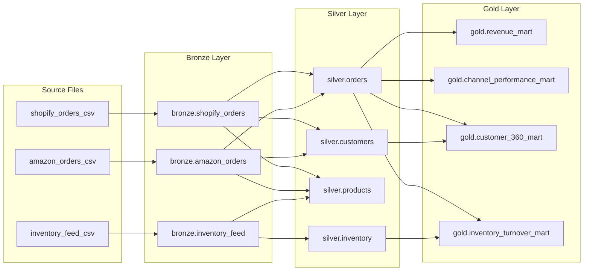

# Data Catalog - Unified Commerce Lakehouse

This catalog documents every table across the Bronze, Silver, and Gold
layers - column-level types, descriptions, ownership, and the business
purpose of each table. It is the human-readable complement to the Hive
Metastore registration (`quality/catalog_registration.py`).

Last updated: 28 June 2026

---

## Bronze Layer

Raw source data, preserved as-is. Partitioned by `_ingestion_date`.
No business transformations applied at this layer.

---

### `bronze.shopify_orders`

**Purpose:** Raw order transactions from the Shopify storefront (mocked)\
**Owner:** E-Commerce Team\
**Source:** Shopify Orders API (synthetic)\
**Refresh:** Daily\
**Location:** `s3a://bronze/shopify_orders`\
**Format:** Delta Lake\
**Partition:** `_ingestion_date`\
**Data Contract:** `docs/contracts/shopify_orders_contract.yaml`

| Column | Type | Nullable | Description |
|---|---|---|---|
| `order_id` | string | No | Unique order identifier |
| `customer_id` | string | No | Reference to the placing customer |
| `product_id` | string | No | Reference to the ordered product |
| `order_date` | date | No | Business date the order was placed |
| `quantity` | integer | No | Units ordered (must be > 0) |
| `revenue` | double | No | Order revenue (must be >= 0) |
| `order_status` | string | Yes | placed / shipped / delivered / cancelled |
| `promo_code_applied` | string | Yes | Schema drift field - upstream addition, not in contract v1.0 |
| `_ingestion_timestamp` | string | No | UTC timestamp when this batch was ingested |
| `_source_system` | string | No | Always `shopify_orders` |
| `_batch_id` | string | No | UUID identifying the ingestion batch run |
| `_ingestion_date` | date | No | Partition key - date of ingestion |

---

### `bronze.amazon_orders`

**Purpose:** Raw marketplace sales from Amazon (mocked)\
**Owner:** Marketplace Team\
**Source:** Amazon Marketplace API (synthetic)\
**Refresh:** Daily\
**Location:** `s3a://bronze/amazon_orders`\
**Format:** Delta Lake\
**Partition:** `_ingestion_date`

| Column | Type | Nullable | Description |
|---|---|---|---|
| `marketplace_order_id` | string | No | Amazon's unique order identifier |
| `customer_id` | string | Yes | Customer reference (nullable - Amazon sometimes omits) |
| `sku` | string | No | Amazon's product identifier (maps to `product_id` in Silver) |
| `quantity` | integer | No | Units ordered |
| `revenue` | double | No | Order revenue |
| `order_timestamp` | timestamp | No | Business timestamp of the order |
| `_ingestion_timestamp` | string | No | UTC timestamp of ingestion |
| `_source_system` | string | No | Always `amazon_orders` |
| `_batch_id` | string | No | UUID identifying the ingestion batch run |
| `_ingestion_date` | date | No | Partition key - date of ingestion |

---

### `bronze.inventory_feed`

**Purpose:** Raw warehouse inventory positions from SFTP file drop (mocked)\
**Owner:** Supply Chain Team\
**Source:** SFTP CSV Drop (synthetic)\
**Refresh:** Daily\
**Location:** `s3a://bronze/inventory_feed`
**Format:** Delta Lake\
**Partition:** `_ingestion_date`

| Column | Type | Nullable | Description |
|---|---|---|---|
| `inventory_id` | string | No | Unique inventory record identifier |
| `product_id` | string | No | Reference to the product |
| `warehouse_id` | string | No | Reference to the warehouse |
| `quantity_available` | integer | No | Units available for sale |
| `quantity_reserved` | integer | Yes | Units reserved for pending orders (nullable in source) |
| `last_updated` | timestamp | No | When the inventory record was last updated |
| `_ingestion_timestamp` | string | No | UTC timestamp of ingestion |
| `_source_system` | string | No | Always `inventory_feed` |
| `_batch_id` | string | No | UUID identifying the ingestion batch run |
| `_ingestion_date` | date | No | Partition key - date of ingestion |

---

## Silver Layer

Cleaned, deduplicated, and conformed canonical entity tables.
Partitioned by business date. No business aggregations.

---

### `silver.orders`

**Purpose:** Canonical orders - conformed from Shopify + Amazon, deduplicated\
**Owner:** Data Engineering Team\
**Built from:** `bronze.shopify_orders`, `bronze.amazon_orders`\
**Location:** `s3a://silver/orders`\
**Format:** Delta Lake\
**Partition:** `order_date`

| Column | Type | Nullable | Description |
|---|---|---|---|
| `order_id` | string | No | Canonical order ID (Shopify: `order_id`, Amazon: `marketplace_order_id`) |
| `customer_id` | string | No | Canonical customer ID (`unknown` if null in source) |
| `product_id` | string | No | Canonical product ID (Amazon's `sku` mapped here) |
| `order_date` | date | No | Business date of the order (partition key) |
| `quantity` | integer | No | Units ordered |
| `revenue` | double | No | Order revenue (non-negative) |
| `order_status` | string | No | Order status (`unknown` if null in source) |
| `channel` | string | No | `shopify` or `amazon` - source channel |

**Deduplication:** window function on (`order_id`, `channel`), keeping the most recent `order_date`. See ADR-005 for rationale.

---

### `silver.customers`

**Purpose:** Canonical customer dimension - distinct customer IDs across all channels
**Owner:** Data Engineering Team
**Built from:** `bronze.shopify_orders`, `bronze.amazon_orders`
**Location:** `s3a://silver/customers`
**Format:** Delta Lake

| Column | Type | Nullable | Description |
|---|---|---|---|
| `customer_id` | string | No | Canonical customer identifier |
| `source` | string | No | First channel where this customer was seen (`shopify` / `amazon`) |
| `_created_at` | timestamp | No | When this record was created in Silver |

---

### `silver.products`

**Purpose:** Canonical product dimension - distinct product IDs across all 3 sources\
**Owner:** Data Engineering Team\
**Built from:** `bronze.shopify_orders`, `bronze.amazon_orders`, `bronze.inventory_feed`\
**Location:** `s3a://silver/products`\
**Format:** Delta Lake

| Column | Type | Nullable | Description |
|---|---|---|---|
| `product_id` | string | No | Canonical product identifier |
| `source` | string | No | First source where this product was seen |
| `_created_at` | timestamp | No | When this record was created in Silver |

---

### `silver.inventory`

**Purpose:** Cleaned inventory positions from the SFTP feed\
**Owner:** Supply Chain Team\
**Built from:** `bronze.inventory_feed`\
**Location:** `s3a://silver/inventory`\
**Format:** Delta Lake\
**Partition:** `order_date`

| Column | Type | Nullable | Description |
|---|---|---|---|
| `inventory_id` | string | No | Unique inventory record identifier |
| `product_id` | string | No | Reference to `silver.products` |
| `warehouse_id` | string | No | Warehouse identifier |
| `quantity_available` | integer | No | Units available (non-negative) |
| `quantity_reserved` | integer | No | Units reserved (null filled to 0) |
| `last_updated` | timestamp | No | Source system last-updated timestamp |
| `order_date` | date | No | Derived from `last_updated` - partition key |

---

## Gold Layer

Business-facing aggregated marts. Partitioned by `order_month` (yyyy-MM).
These are the tables business analysts and reporting tools query directly.

---

### `gold.revenue_mart`

**Purpose:** Daily revenue aggregated by channel and order status\
**Owner:** Analytics Team\
**Built from:** `silver.orders`\
**Location:** `s3a://gold/revenue_mart`\
**Format:** Delta Lake\
**Partition:** `order_month`

**Business question answered:** "What was our total revenue on any given day, broken down by channel and order status?"

| Column | Type | Nullable | Description |
|---|---|---|---|
| `order_date` | date | No | Business date |
| `channel` | string | No | `shopify` or `amazon` |
| `order_status` | string | No | Order status |
| `total_revenue` | double | No | Sum of revenue for this group |
| `total_quantity` | integer | No | Sum of units sold |
| `order_count` | long | No | Number of orders |
| `avg_order_value` | double | No | Average revenue per order |
| `order_month` | string | No | Partition key - yyyy-MM format |

---

### `gold.channel_performance_mart`

**Purpose:** Monthly Shopify vs Amazon performance comparison\
**Owner:** Analytics Team\
**Built from:** `silver.orders`\
**Location:** `s3a://gold/channel_performance_mart`\
**Format:** Delta Lake\
**Partition:** `order_month`

**Business question answered:** "Which channel is performing better month over month?"

| Column | Type | Nullable | Description |
|---|---|---|---|
| `order_month` | string | No | Partition key - yyyy-MM format |
| `channel` | string | No | `shopify` or `amazon` |
| `total_revenue` | double | No | Monthly revenue for this channel |
| `total_units_sold` | integer | No | Monthly units sold |
| `total_orders` | long | No | Monthly order count |
| `avg_order_value` | double | No | Average order value |
| `unique_customers` | long | No | Distinct customers who ordered |

---

### `gold.customer_360_mart`

**Purpose:** Unified lifetime customer metrics\
**Owner:** CRM Team\
**Built from:** `silver.orders`, `silver.customers`\
**Location:** `s3a://gold/customer_360_mart`\
**Format:** Delta Lake\
**Partition:** `order_month` (based on `last_order_date`)

**Business question answered:** "Who are our customers, how much have they spent, and when did they last order?"

| Column | Type | Nullable | Description |
|---|---|---|---|
| `customer_id` | string | No | Canonical customer identifier |
| `source` | string | No | First channel where customer was seen |
| `lifetime_revenue` | double | No | Total spend across all channels (0 if no orders) |
| `total_orders` | long | No | Lifetime order count (0 if no orders) |
| `total_units_purchased` | integer | Yes | Total units purchased |
| `avg_order_value` | double | Yes | Average order value |
| `first_order_date` | date | Yes | Date of first order |
| `last_order_date` | date | Yes | Date of most recent order |
| `channels_used` | long | Yes | Number of distinct channels used |
| `order_month` | string | Yes | Partition key - derived from `last_order_date` |

---

### `gold.inventory_turnover_mart`

**Purpose:** Stock movement and turnover metrics per product and warehouse\
**Owner:** Supply Chain Team\
**Built from:** `silver.inventory`, `silver.orders`\
**Location:** `s3a://gold/inventory_turnover_mart`\
**Format:** Delta Lake\
**Partition:** `order_month`

**Business question answered:** "How fast is inventory moving? Which products are overstocked or understocked?"

| Column | Type | Nullable | Description |
|---|---|---|---|
| `inventory_id` | string | No | Inventory record identifier |
| `product_id` | string | No | Reference to `silver.products` |
| `warehouse_id` | string | No | Warehouse identifier |
| `quantity_available` | integer | No | Units currently available |
| `quantity_reserved` | integer | No | Units reserved |
| `net_available` | integer | No | `quantity_available - quantity_reserved` |
| `total_units_sold` | integer | No | Units sold (from orders; 0 if no sales) |
| `turnover_ratio` | double | No | `total_units_sold / quantity_available` (0 if no stock) |
| `last_updated` | timestamp | No | Source system last-updated timestamp |
| `order_month` | string | No | Partition key - derived from `last_updated` |

---

## Lineage Summary

Full interactive lineage graph: Marquez UI at `http://localhost:3000`